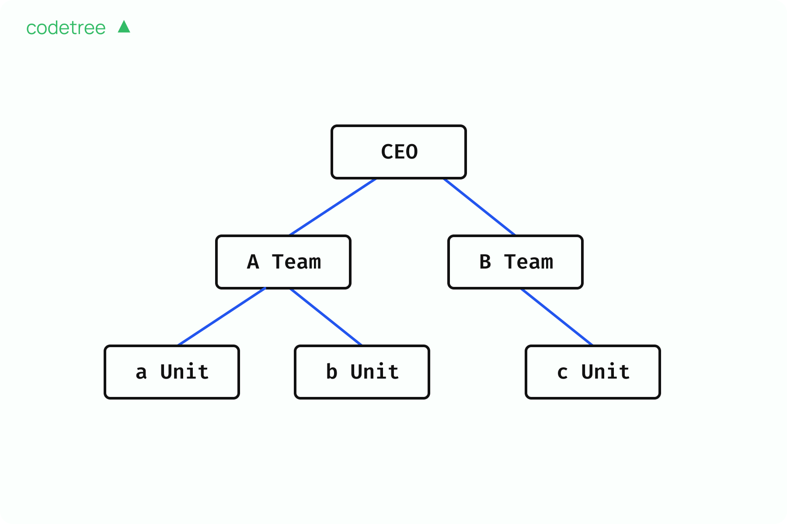

# 트리

트리: 모든 노드가 서로 하나의 연결요소로 이어져 있고 사이클이 없는 무방향 그래프.

- Unrooted tree: 루트가 정해지지 않은 트리.

- Rooted tree: 특정 노드를 루트로 정해 부모/자식, 깊이 등이 정의된 트리. (루트 선택은 임의)

## 기본 용어

- 노드(Node): 트리의 지점(정점).

- 간선(Edge): 노드와 노드를 잇는 선.

- 루트 노드(Root): 트리의 기준이 되는 최상단 노드(루트가 정해졌을 때).

- 부모/자식: 간선으로 연결된 두 노드 중 위가 부모, 아래가 자식.

- 차수(Degree): (해당 노드 기준) 연결된 간선 수. Rooted tree에서는 보통 “자식 수”를 말할 때도 있음.

- 깊이(Depth): 루트로부터의 거리(간선 수).

- 높이(Height): 트리에서 가장 큰 깊이 또는 그 +1.

- 리프(Leaf): 자식이 없는 노드. Unrooted tree에서는 차수 1인 노드를 리프로 정의.

## 트리가 아닌 경우

그래프가 모두 연결되어 있지 않으면 트리가 아님.

사이클이 존재하면 트리가 아님.

## 루트 선택과 표현

Unrooted tree에서는 루트를 임의로 선택할 수 있음.
루트를 정하는 순간부터 부모/자식, 깊이, 높이 등이 결정됨.

같은 트리라도 1번을 루트로 그리거나 2번을 루트로 그릴 수 있어 표현이 달라짐.