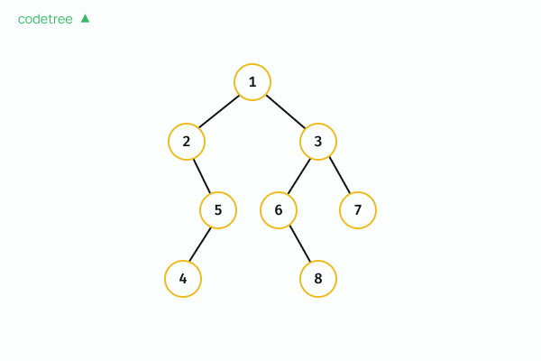

# 이진트리 탐색

재귀를 사용하면 탐색

세 방식: 위 탐색 (Preorder Traversal), 중위 탐색 (Inorder Traversal), 후위 탐색 (Postorder Traversal)

## 1. 전위 탐색 (Preorder Traversal)
- **순서**: 부모 → 왼쪽 자식 → 오른쪽 자식
- **설명**: 모든 노드에 대해 부모를 먼저 방문한 후, 왼쪽 자식들을 전부 순회하고, 그 이후에 오른쪽 자식들을 방문합니다.
- **결과**: `1 - 2 - 5 - 4 - 3 - 6 - 8 - 7`

---

## 2. 중위 탐색 (Inorder Traversal)
- **순서**: 왼쪽 자식 → 부모 → 오른쪽 자식
- **설명**: 모든 노드에 대해 왼쪽 자식들을 전부 순회한 후, 부모를 방문하고, 그 이후에 오른쪽 자식들을 방문합니다.
- **결과**: `2 - 4 - 5 - 1 - 6 - 8 - 3 - 7`

---

## 3. 후위 탐색 (Postorder Traversal)
- **순서**: 왼쪽 자식 → 오른쪽 자식 → 부모
- **설명**: 모든 노드에 대해 왼쪽 자식들을 전부 순회한 후, 오른쪽 자식들을 전부 순회하고, 마지막으로 부모를 방문합니다.
- **결과**: `4 - 5 - 2 - 8 - 6 - 7 - 3 - 1`