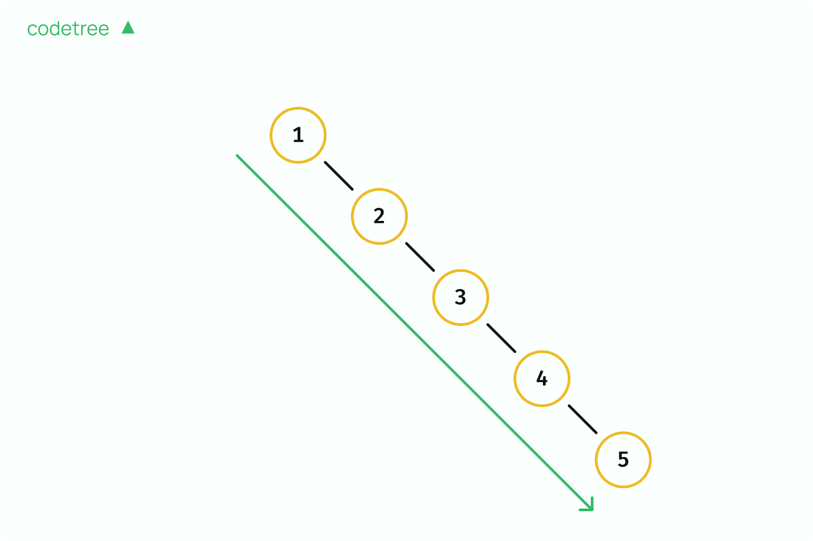

# 이진 탐색 트리

주머니의 왼쪽 방향에 있는 노드들은 전부 부모보다 값이 작고 부모의 우측에 있는 노드들은 전부 부모 보다 값이 큰 이진트리

중위 순회시 오름차순 정렬된 순서로 출력됨

## 이진 탐색 트리의 탐색

루트 노드에 시작하여 값 x 찾기

현재 노드 값이 x보다 크면 ->  node.left
현재 노드 값이 x보다 작으면 -> node.right

트리에 값이 없다면 null 반환

```Pseudo
function bst.search(x)
    set node = bst.root                     // root에서 시작합니다.
    while node != null and node.value != x  // node에 들어있는 값이 x가 되기 전까지 계속 반복합니다.
        if node.value > x                   // 노드에 있는 값이 x보다 크다면
            node = node.left                // 왼쪽 자식으로 내려와 탐색을 진행합니다. 
        else                                // 노드에 있는 값이 x보다 작다면
            node = node.right               // 오른쪽 자식으로 내려와 탐색을 진행합니다.
    
    return node                             // 최종 위치를 반환합니다.

```

## 이진 탐색 트리의 삽입

null에 도달하기 전까지 계속 진행하여 값 x가 들어갈 위치를 찾기, null 지접의 parent 정보도 알아야 함

삽입:  

**Case 1.** 트리에 노드가 전혀 없는 경우  
이 경우에는 parent값이 null일 것이며, 이진 탐색 트리의 root를 node(x)로 설정해줘야 함

**Case 2.** parent에 적혀있는 값이 삽입하려는 값 x보다 더 큰 경우  
이 경우에는 parent의 왼쪽에 node(x)를 넣어줘야 함

**Case 3.** parent에 적혀있는 값이 삽입하려는 값 x보다 더 작은 경우  
이 경우에는 parent의 오른쪽에 node(x)를 넣어줘야 함

```Pseudo
function bst.insert(x)
    set node = bst.root          // root에서 시작합니다.
    set parent = bst.root        // parent도 root로 설정하고 시작합니다.

    while node != null           // node가 null이 되기 전까지 반복합니다.
        parent = node            // parent는 항상 node가 움직이기 직전의 위치로 갱신해줍니다. 
        if node.value > x        // node에 적혀있는 값이 x보다 크다면
            node = node.left     // 왼쪽 자식으로 이동해야 합니다. 
        else                     // node에 적혀있는 값이 x보다 작다면
            node = node.right    // 오른쪽 자식으로 이동해야 합니다.
    
    if parent == null            // Case 1. 비어있는 tree라면
        bst.root = node(x)       // root를 node(x)로 설정해줍니다.
    else if parent.value > x     // Case 2. parent에 적혀있는 값이 추가하려는 값 x보다 크다면
        parent.left = node(x)    // parent의 왼쪽에 node(x)를 넣어줍니다.
    else                         // Case 3. parent에 적혀있는 값이 추가하려는 값 x보다 작다면
        parent.right = node(x)   // parent의 오른쪽에 node(x)를 넣어줍니다.

```

## 이진 탐색 트리의 삭제

1. 삭제하려는 값 x 찾기
2. 다음 3 케이스 중 1
   1. x 값의 노드의 왼쪽 노드가 비어있는 경우 -> 오른쪽 노드 올리기
   2. x 값의 노드의 오른쪽 노드가 비어있는 경우 -> 왼쪽 노드 올리기
   3. 왼쪽, 오른쪽 노드가 전부 차 있는 경우
      - successor(x 값 보다 크면서 가장 작은 값을 갖는 노드) 찾기
        - x 값 노드의 오른쪽 자식(node.right)을 시작으로 왼쪽으로 최대로 내려간 노드
      - successor가 오른쪽 자식이라면 바로 올려주기
      - 아니라면 successor로 값을 대체하고 successor의 자식을 successor 자리로 올려주기
  
```Pseudo
function bst.search(x)
    set node = bst.root                     
    while node != null and node.value != x 
        if node.value > x                
            node = node.left           
        else                               
            node = node.right           
    
    return node            

function bst.minimum(node)                  // node 하위 트리에서 최솟값을 구합니다.
    while node.left != null                 // node의 left가 null이 아니면 계속 내려갑니다.
        node = node.left
    return node                             // 최종 node의 위치를 반환합니다.

function bst.delete(x)                      // x를 찾아 삭제하는 함수입니다.
    set node = bst.search(x)                // x 값을 찾습니다.
    
    if node.left == null                    // Case 1. node의 왼쪽 자식이 비어있다면
        move(node.right, node)              // 오른쪽 자식을 위로 올려줍니다.
    else if node.right == null              // Case 2. node의 오른쪽 자식이 비어있다면
        move(node.left, node)               // 왼쪽 자식을 위로 올려줍니다.
    else                                    // Case 3. 왼쪽 오른쪽 자식이 모두 채워져있다면
        set succ = bst.minimum(node.right)  // 해당 노드의 successor를 구합니다.
                                            // 이는 현재 노드의 오른쪽 자식에서 시작하여 계속 왼쪽으로 내려가는 것을
                                            // 반복하면 가능합니다.
        if succ == node.right               // 만약 successor가 현재 노드의 오른쪽 자식이라면 
            move(node.right, node)          // 오른쪽 자식을 위로 올려줍니다.
        else                                // 그렇지 않은 일반적인 경우라면
            node.value = succ.value         // node의 값을 successor의 값으로 대체시켜준 뒤,
            move(succ.right, succ)          // successor의 오른쪽 자식을 위로 끌어올려줍니다.

```

## 균형잡힌 이진 탐색 트리

이진탐색트리의 삽입/삭제/탐색의 시간복잡도

위와 같은 최악의 경우 시간복잡도는 O(N)이 됨

균형잡힌 이진 탐색 트리(Red Black Tree나 AVL Tree)는 이진 탐색 트리를 특정 규칙에 따라 관리함

- 트리의 높이를 항상 logN으로 유지 -> 시간복잡도 항상 O(logN)
- 삽입, 삭제가 일어나는 순간 루트 노드와 주위에 있는 노드를 회전 등의 작업을 통해 적절하게 조절하므로서 왼쪽 자식과 오른쪽 자식에 있는 노드간의 높이 차가 크게 벌어지지 않도록 함
