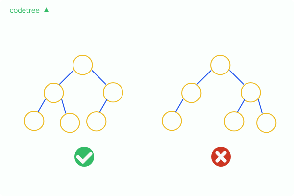

# 힙

종류: max-heap, min-heap

특정 수가 추가되고 삭제되었을 때 원하는 heap 구조를 유지하는 데 O(logn) 만큼이 소요

주어진 수들 중 최대 최소값을 O(1)에 구할 수 있도록 만들어줌

## 완전 이진 트리

트리의 모든 값이 왼쪽에서 순서대로 차 있는 것을 의미



## max-heap

모든 노드에 대해 부모 노드가 자신의 자식 노드가 갖는 값보다 같거나 큰 경우

특징: 루트 노드에는 전체 숫자 중 최댓값이 항상 들어 있다

시간복잡다: 
- max-heap을 만드는 데는 시간이 O(n) 만큼 소요
- 이후 특정 원소 하나를 삭제, 삽입했을 때에는 완전 이진 트리에서의 삽입 삭제이므로 O(logn) 시간만 소요
- 최댓값은 루트 노드이므로 max-heap이 만들어져 있는 상황이라면 O(1)에 계산 가능

## 특징

- max-heap에서의 삭제는 루트 노드에서만 가능
- max-heap에서는 k 번째 최댓값을 구할 수 없음
- 최댓값을 단 한 번만 찾아야 하는 경우 순차탐색이 더 간편함
- 원소의 추가, 최댓값의 삭제가 빈번한 경우에만 heap 사용

## 힙 만들기

숫자들을 1번 인덱스부터 순서대로 배열에 넣어 배열로 구현한 이진 트리 형태를 만든다.

**heapify**: 현재 노드를 기준으로 이 노드가 heap 특성에 맞을 때까지 계속 밑으로 내려주는 과정

n/2번째 원소부터 거꾸로 1번까지 순서대로 heapify 진행
(n/2 초과 인덱스의 노드는 리프노드로 이미 힙을 만족함)

### heapify

- 현재 노드 위치를 i라고 한다면, 현재 노드, 왼쪽 자식(i * 2번째) 노드, 그리고 오른쪽 자식(i * 2 + 1번째) 노드 중 가장 큰 노드가 무엇인지 판단. 이 세 노드 중 가장 큰 노드를 편의상 largest 노드라고 정의
- 만약 largest 노드가 현재 노드 i가 아닌 자식 노드라면, 현재 노드(i)와 해당 자식 노드(largest)의 값을 교환. 교환 이후에는 다시 largest 위치에서 heapify를 진행. 이렇듯 현재 노드가 heap 조건을 만족하도록 계속 내려주는 것을 재귀적으로 반복
- 만약 largest 노드가 현재 노드 i라면, 종료

즉:  heapify 함수는 i번째 노드가 max-heap 조건을 만족하도록, 자식 노드와 비교하여 더 큰 노드가 현재 노드가 아니라면 계속 밑으로 내려가 주는 함수

```Pseudo
function heapify(arr[], n, i)
  set largest = i                     // 최대 노드가 i번이라고 가정합니다.
  set l = i * 2                       // 왼쪽 자식 노드 번호입니다.
  set r = i * 2 + 1                   // 오른쪽 자식 노드 번호입니다.

  if l <= n && arr[l] > arr[largest]  // 왼쪽 자식이 크다면, 최대 번호를 수정합니다.
    largest = l

  if r <= n && arr[r] > arr[largest] // 오른쪽 자식이 크다면, 최대 번호를 수정합니다.
    largest = r

  if largest != i                   // 최대 노드가 자식 노드라면
    swap(arr[i], arr[largest])      // 해당 자식과 현재 노드를 교환해준 뒤
    heapify(arr, n, largest)        // 내려간 위치에서 다시 heapify를 진행합니다.
```

```Pseudo
function build_heap(arr[], n)
  for i = n / 2 ... i >= 1       // n / 2번째 원소부터 1번째 원소까지 돌며
    heapify(arr, n, i)             // heapify 과정을 진행하여 max-heap을 만들어줍니다.
```

## 시간복잡도

heap은 이진트리 중에서도 왼쪽으로 가득 채워져있는 완전 이진 트리 모양 -> 높이: logN => 1회 heapify 총 logN 번

build_heap 시간복잡도는 O(NlogN)이 아닌 O(N)

## 힙의 삽입

1. 트리의 맨 끝에 값 삽입
2. 삽입된 값을 부모가 더 큰 값을 가질 때까지 위로 올림

시간복잡도: O(logN)

```Pseudo
function insert(arr[], n, x)
  arr.append(x)                          // 가장 끝에 노드 x를 추가합니다.

  set i = n + 1                          // 마지막 노드에서 시작합니다.
  while i > 1 and arr[i / 2] < arr[i]    // 부모가 자식보다 값이 작은 경우라면
                                         // max-heap 조건에 어긋나므로
    swap(arr[i], arr[i / 2])             // 두 값을 교환하고
    i = i / 2                            // 부모 위치로 올라갑니다.
```

## 힙의 삭제

1. 트리의 마지막 노드를 루트 노드로 올린다. (루트노드를 마지막 노드로 덮어쓰기, 마지막 노드 삭제)
2. heapify(1) 수행

heapify 과정은 시간복잡도가 O(logN)이므로 삭제 과정의 시간복잡도 역시 O(logN)

```Pseudo
function remove(arr[], n)
  arr[1] = arr[n]                   // 가장 끝에 있는 노드를 첫 번째 노드에 옮겨주고
  delete arr[n]                     // 가장 마지막 노드를 삭제합니다.
  heapify(arr, n - 1, 1)            // 직후에 1번 노드를 기준으로 heapify를 진행하여
                                    // max-heap 상태를 계속 유지해줍니다. 
```
